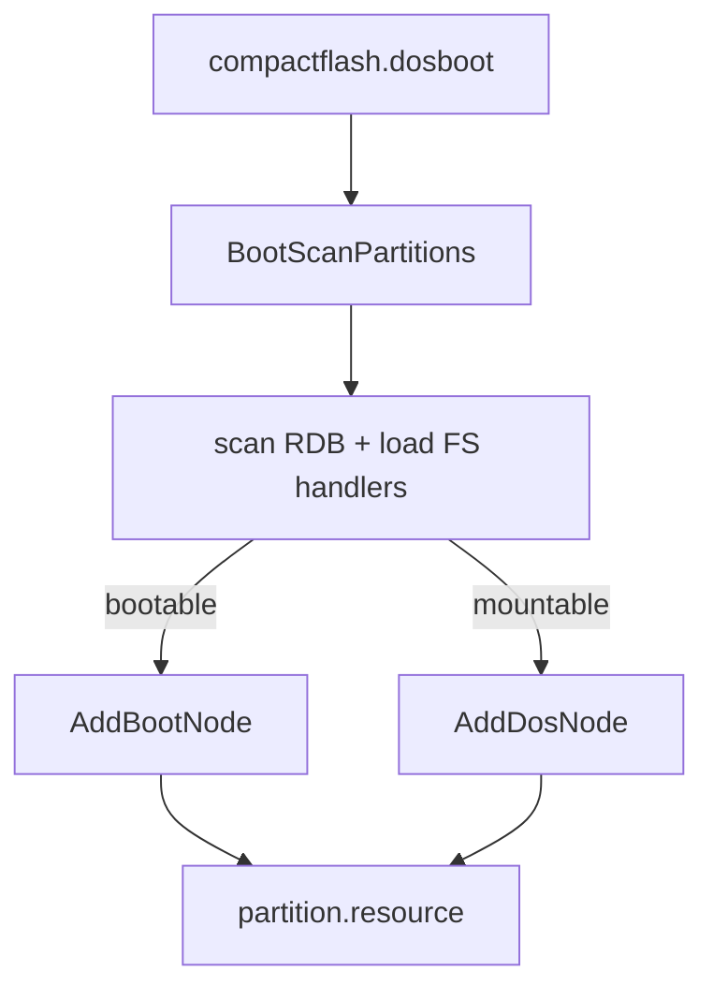
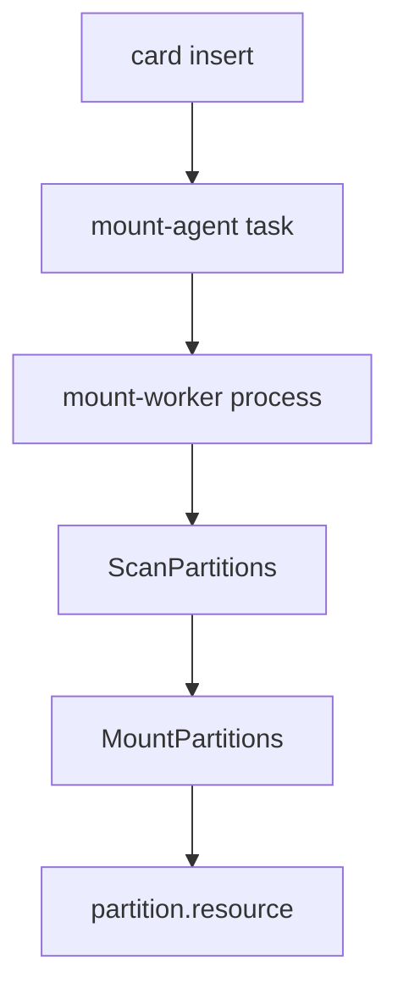
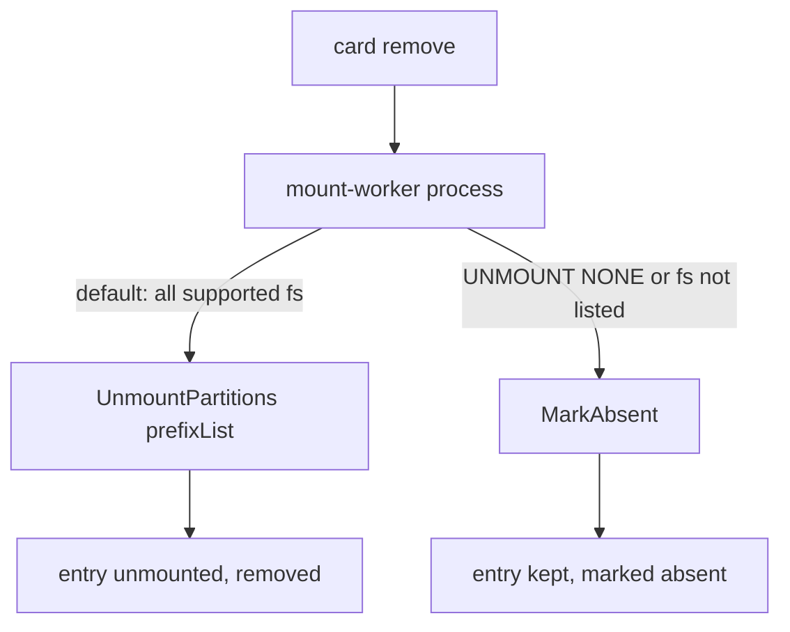
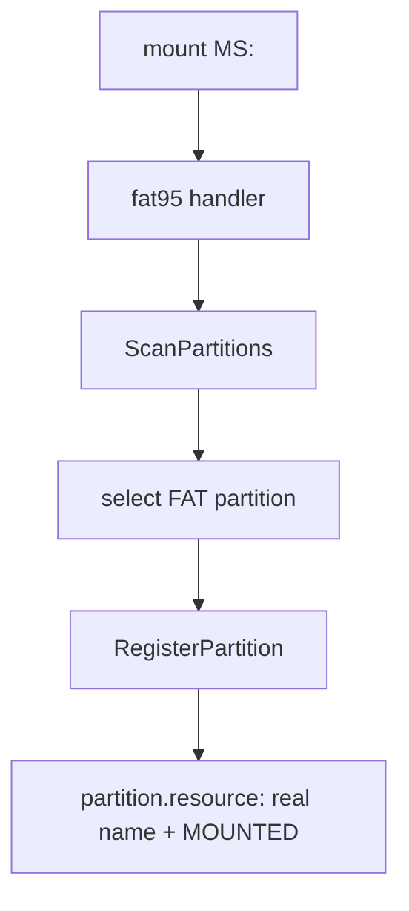

# ptable.library: unified partition-table library

`ptable.library` is the AmigaOS partition-table library. It parses every partition scheme a removable card might carry (**RDB**, **MBR**, **GPT**, and the partition-table-less **flat** superfloppy, a whole-disk FAT volume) and publishes the result into `partition.resource`. A device driver and a filesystem handler then share that one parse instead of each carrying its own.

You do not run `ptable.library`; other components open it. This document explains what it does and how its behaviour is configured. The `lsptres` tool (see [`lsptres.md`](lsptres.md)) shows what it has discovered at runtime. The library ships alongside its consumer `compactflash.device`, or embedded in a Kickstart ROM for cold-boot autoboot (see the [amigaos-kickstart-builder](https://github.com/pulchart/amigaos-kickstart-builder) repo).

## What it does

`ptable.library` has two jobs, used at two different times.

- **Cold-boot RDB autoboot.** At Kickstart cold start, before DOS exists, the `compactflash.dosboot` module calls `BootScanPartitions`. The library walks the RDB on the card, loads any filesystem handlers stored in the RDB into `FileSystem.resource`, and registers each partition: bootable ones via `AddBootNode` (they appear in the Early Startup boot menu), mountable-only ones via `AddDosNode`. This is what lets you boot directly from an RDB-partitioned card in the PCMCIA slot.

- **DOS-time scan and automount.** When a card is hotplugged after the machine is up, the consumer calls `ScanPartitions` to publish the card's partitions into `partition.resource`, then `MountPartitions` to mount them. On removal it calls `MarkAbsent` (keep the handler) or `UnmountPartitions` (unmount and remove). This is what automounts FAT cards. In `compactflash.device` automount is on by default; `AUTOMOUNT 0` in `cfd.prefs` turns it off. `ScanPartitions` runs the same scanner the cold path uses (RDB, MBR, GPT, flat). Partitions already published (the cold-boot card, or a previous scan of the same card) are skipped one by one, so nothing is published twice.

One parser serves all three readers: the driver, the FAT handler, and the lister all read the same published partition list.

## Flows

The four use cases, shown as the LVO calls each one drives. They all end at `partition.resource`, the shared registry.

**Cold-boot RDB autoboot.** The `compactflash.dosboot` cold stub calls `BootScanPartitions`; bootable RDB partitions become boot-menu entries, the rest mountable volumes.



**Hotplug attach (DOS time).** A card insert wakes the consumer's mount worker, which publishes then mounts the card's partitions.



**Hotplug detach (card removed).** Two policies (see [Configuration](#configuration)): keep the handler (mark absent) or unmount and remove it.



**Handler mount, auto-detect (e.g. fat95).** A handler probes a card, lets `ScanPartitions` publish the candidates, picks its partition, and overlays its real DOS name with `RegisterPartition`.



## Configuration

`ptable.library` has no preferences file of its own. Its behaviour is configured from two places.

**1. On-disk RDB metadata (cold-boot path).** Each RDB partition carries its own boot priority and flags, and the library uses them as-is:

| RDB partition flag | BootPri | Result |
|--------------------|---------|--------|
| normal | >= 0 | bootable: appears in the Early Startup boot list |
| normal | < 0 | non-bootable: mounted as a DOS volume |
| NOMOUNT (bit 1) | any | published but never mounted (skipped) |

To change which partition boots, or whether one mounts, you edit the RDB with a partitioning tool (e.g. HDToolBox), not the library.

**2. The consumer's mount configuration (`MountCfg`, DOS-time path).** `MountPartitions` takes an optional `MountCfg` that supplies a global mount `Flags` value, a global `CONTROL` string, and a per-filesystem override table. The library resolves each partition's `Flags` and `CONTROL` by its DosType (matching the high three bytes, e.g. `FAT\0`), falling back to the global value. Passing `0` selects cold-boot defaults.

For `compactflash.device`, these values come from `ENV:cfd.prefs`: the `FLAGS` and `CONTROL` keys, both global and `_<fs>` per filesystem (e.g. `FLAGS_FAT`, `CONTROL_FAT`). So to change how hotplugged cards mount, you edit `cfd.prefs`, not `ptable.library`. The resolved values are recorded per partition and shown live by `lsptres` in its `MFlg` and `Ctrl` columns. This is only the automount path: a partition mounted statically instead shows the Flags and CONTROL its own handler opened the device with (see [Partition naming](#partition-naming)), since that handler records them the same way via `RegisterPartition`.

The full user-facing reference for the `cfd.prefs` keys (`AUTOMOUNT`, `FLAGS`, `CONTROL`, `UNMOUNT`, and the per-filesystem overrides), plus deployment defaults and the removable-media model, is `compactflash.device`'s automount guide (`automount.guide`).

**Detach policy (card removal).** The library offers two ways to handle a removed card's partitions, and the consumer chooses per filesystem:

- **Unmount and remove (`compactflash.device` default), `UnmountPartitions` with a prefix list:** stop the handler, remove its DOS node (ACTION_DIE + RemDosEntry + free the node), and drop the partition's resource entry from the list. `compactflash.device` applies this to all supported filesystems by default; an explicit `UNMOUNT` key in `cfd.prefs` restricts it to the listed ones, e.g. `UNMOUNT FAT`. With no prefix list, `UnmountPartitions` unmounts and frees every partition for the device and unit.
- **Keep, `MarkAbsent`:** clear `PRESENT` but keep the DOS node and handler in memory. The entry stays listed as absent-but-mounted (`---M`), and reinserting the same card reattaches it without re-initialising the handler. This is the native AmigaOS removable-media model. For `compactflash.device` this applies to filesystems not listed in an explicit `UNMOUNT` key (`UNMOUNT NONE` keeps everything).

## Partition naming

**RDB** partitions keep their on-disk name (`pb_DriveName`) verbatim (e.g. `DH0`).

**MBR, GPT, and flat** partitions carry no on-disk name, so the library synthesizes one: `PREFIX` + unit-letter + partition-number.

- **PREFIX:** a short device abbreviation from a built-in table, or, for devices not in the table, the device's base name with `.device` stripped and the `A-Z` and `0-9` characters uppercased. Currently only `compactflash.device` has an abbreviation (`CF`); everything else falls back to the base name.
- **unit-letter:** lowercase `a` + unit (`a` = unit 0, `b` = unit 1, up to `p` = unit 15).
- **partition-number:** 0-based decimal.

| Device | Unit | Synthesized names |
|--------|------|-------------------|
| `compactflash.device` (abbrev `CF`) | 0 | `CFa0`, `CFa1`, `CFa2` |
| `scsi.device` (base name to `SCSI`) | 0 | `SCSIa0`, `SCSIa1` |
| `scsi.device` | 2 | `SCSIc0`, `SCSIc1` |
| `mfm.device` (base name to `MFM`) | 1 | `MFMb0`, `MFMb1` |

To give a device its own abbreviation instead of the base-name fallback, add it to `s_devAbbrevTable` in [`../src/ptable_scan.s`](../src/ptable_scan.s). Name clashes with existing mounts are uniquified at register time.

**Overriding the name with a static mountlist.** The synthesized name is only the *scan* name. If you mount a partition yourself with a static `DEVS:DOSDrivers` entry, the handler registers the real DOS device name (along with the Flags and CONTROL it opened the device with) back onto the published entry, matched by device, unit, and start block, so the partition is reachable under the name you chose and `lsptres` shows that mount's `MFlg` and `Ctrl`. `lsptres` then shows both names, as `scanname>dosname`: e.g. `CFa0>MS0` is the partition the library scanned as `CFa0`, mounted as `MS0:` from your mountlist. This is the same `RegisterPartition` path cfd's automount uses, so the `MFlg` and `Ctrl` columns are accurate whether a partition was automounted or mounted statically. RDB partitions always keep their on-disk name.

## What it looks like (serial debug)

The `full` build prints its progress to the serial port at 9600 baud. The library tags its own lines `[PT]`, and the cold-boot module `compactflash.dosboot` tags the cold-boot hand-off `[CFD] boot:`. The `small` build is silent.

**Cold boot, RDB autoboot.** `compactflash.dosboot` opens the library and calls `BootScanPartitions`; the library walks the RDB and registers the mountable partitions:

```
[CFD] boot: open ptable.library ...
[CFD] boot: ptable.library not preloaded, InitResident()...
[CFD] boot: BootScanPartitions(compactflash.device,0)
[PT] cold boot: scanning for partitions
[PT] RDB partition table
[PT] partitions found: 5
[PT] - skip  SDH10 (no-mount)
[PT] - skip  SDH11 (no-mount)
[PT] + boot  SDH0 (PFS, 512 MB)
[PT] + mount SDH1 (PFS, 4096 MB)
[PT] + mount SDH2 (PFS, 21767 MB)
[PT] cold boot done, partitions registered: 3
```

Five partitions are found; the two NOMOUNT entries are skipped, one bootable is registered (`+ boot`) and two mountable (`+ mount`), so three are registered.

**Hotplug, DOS-time scan.** An inserted card is scanned, its partitions published, then mounted by the consumer's mount worker. Here a GPT card with three FAT partitions in the PCMCIA slot, automounted:

```
[PT] scanning for partitions
[PT] GPT partition table
[PT] partitions found: 3
[PT] mounting partitions
[PT] mounted CFa0 (FAT, 2048 MB)
[PT] mounted CFa1 (FAT, 4096 MB)
[PT] mounted CFa2 (FAT, 8192 MB)
```

The resulting `partition.resource`, listed by `lsptres` (columns explained in [`lsptres.md`](lsptres.md); `Text` is the four-character text of the DosType):

```
Name         Device        Unit Part Src Pri DosType    Text Flags MFlg Ctrl
------------ ------------- ---- ---- --- --- ---------- ---- ----- ----- ----------
CFa0         compactflash.    0    0 GPT   0 0x46415400 FAT. P--M      0 -d-D
CFa1         compactflash.    0    1 GPT   0 0x46415400 FAT. P--M      0 -d-D
CFa2         compactflash.    0    2 GPT   0 0x46415400 FAT. P--M      0 -d-D
```

The three FAT partitions show the synthesized scan name (`CFa0`..`CFa2`), all mounted (`P--M`), with the `Ctrl` value `-d-D` resolved from `CONTROL_FAT` in `cfd.prefs`.

**Hotplug, card removed.** On removal the library has two policies (see [Detach policy](#configuration)). With the keep policy (`UNMOUNT NONE` in `cfd.prefs`, or a filesystem not listed in an explicit `UNMOUNT` key) each partition's handler stays in memory and is just marked absent, so the entry stays in the resource with `PRESENT` cleared (`---M`) and reinserting the same card reattaches it:

```
[PT] card removed, media absent
```

```
Name         Device        Unit Part Src Pri DosType    Text Flags MFlg Ctrl
------------ ------------- ---- ---- --- --- ---------- ---- ----- ----- ----------
CFa0         compactflash.    0    0 GPT   0 0x46415400 FAT. ---M      0 -d-D
CFa1         compactflash.    0    1 GPT   0 0x46415400 FAT. ---M      0 -d-D
CFa2         compactflash.    0    2 GPT   0 0x46415400 FAT. ---M      0 -d-D
```

By `compactflash.device`'s default (all supported filesystems in the unmount list, here equally with `UNMOUNT FAT`), the FAT partitions are instead unmounted and removed entirely: handlers stopped, DOS nodes removed, and dropped from the resource (the list ends up empty):

```
[PT] card removed, media absent
[PT] unmounting partitions
[PT] unmounted CFa0
[PT] unmounted CFa1
[PT] unmounted CFa2
```

## Public interface (LVOs)

For consumers. Full struct field layout for `MountCfg`, `PartEntry`, and `partition.resource` lives in the public header [`../src/ptable_pub.i`](../src/ptable_pub.i).

```
BootScanPartitions(deviceName:a1, unit:d0)                 -30  cold-boot RDB scan + register
ScanPartitions(deviceName:a1, unit:d0)                     -36  publish RDB/MBR/GPT/flat -> partition.resource
MountPartitions(deviceName:a1, unit:d0, cfg:a0)            -42  AddDosNode(ADNF_STARTPROC) the entries
UnmountPartitions(deviceName:a1, unit:d0, prefixList:a0)   -48  ACTION_DIE + RemDosEntry + free (prefixList=0: all; else by dostype, rest kept)
RegisterPartition(deviceName:a1, unit:d0, ...)            -54  overlay a handler's real DOS name/flags onto an entry
MarkAbsent(deviceName:a1, unit:d0)                         -60  card removed: clear PRESENT, keep handler in memory
```

- `OpenLibrary("ptable.library", 1)` is enough for the cold-boot RDB path (`BootScanPartitions`); the DOS-time scan and mount calls require version `2`. A v1 library has only `BootScanPartitions`.
- `BootScanPartitions` runs from an `RTF_COLDSTART` context (pre-DOS, single task). `RegisterPartition` and `MarkAbsent` are Exec-only; `MountPartitions` and `UnmountPartitions` must be called from a process.
- `cfg` is a `MountCfg` (or `0` for cold-boot defaults): global `mc_Flags` and `mc_Control` plus a 0-terminated per-dostype override table. The library resolves each entry by `(pe_DosType & $FFFFFF00)`.
- `ScanPartitions` detects all four schemes; entries already published (by the cold path or a previous scan) are skipped one by one, so nothing publishes or mounts twice.
- `partition.resource` is the runtime single source of truth for discovered partitions; readers walk its list under `Forbid()` or take its semaphore. Its layout and the `PartEntry` fields are documented in [`../src/ptable_pub.i`](../src/ptable_pub.i).

## See also

- [`lsptres.md`](lsptres.md): the `lsptres` CLI lists `partition.resource`, every partition this library has published, its mount state, and the resolved Flags and CONTROL.
- `cfd.prefs`: the `FLAGS` and `CONTROL` keys (global and `_<fs>` per filesystem) that `compactflash.device` turns into the `MountCfg` for `MountPartitions`.
- [`compactflash.device`](https://github.com/pulchart/cfd): the primary consumer (cold-boot autoboot + hotplug automount).
- [`fat95`](https://github.com/pulchart/fat95): reads `partition.resource` for whole-disk partition auto-detection.
- [`../src/ptable_pub.i`](../src/ptable_pub.i): the public consumer header with full LVO, `MountCfg`, and `PartEntry` definitions.
