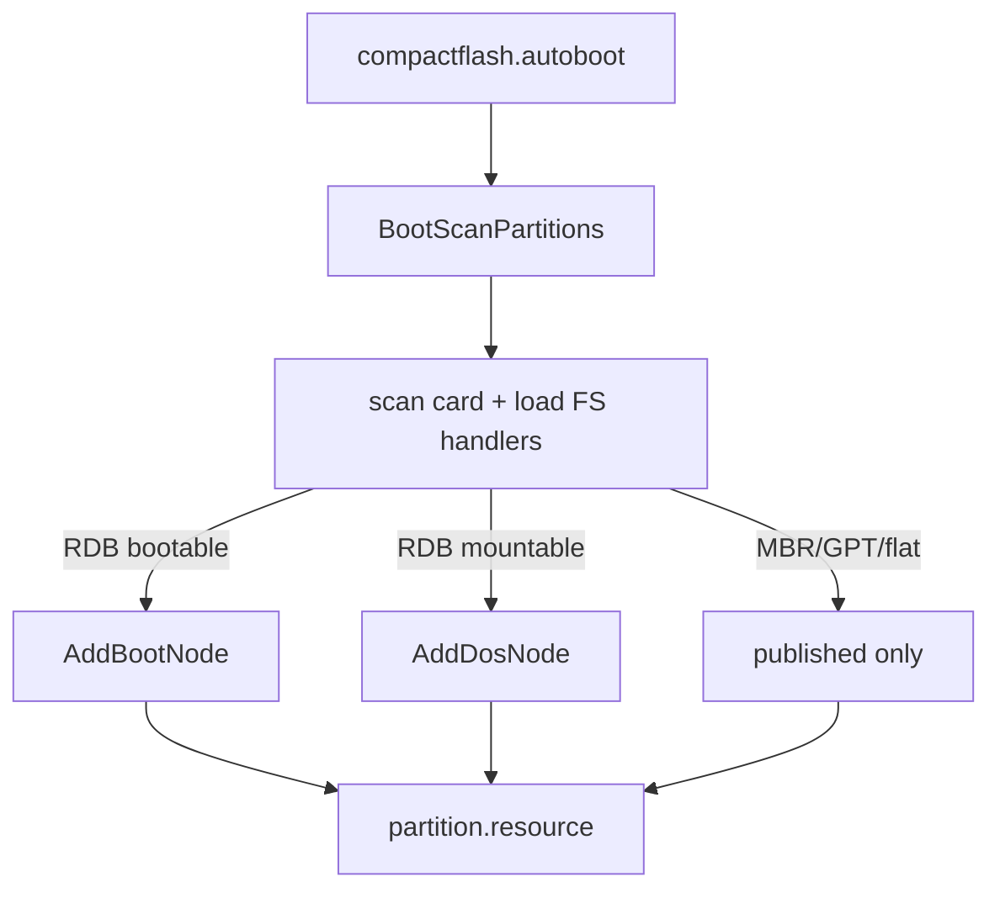
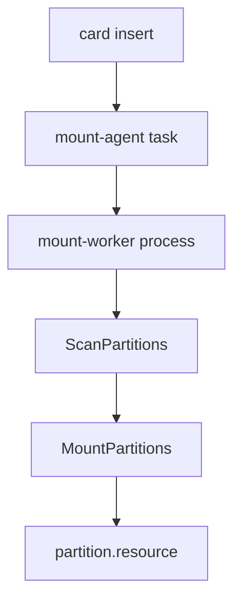
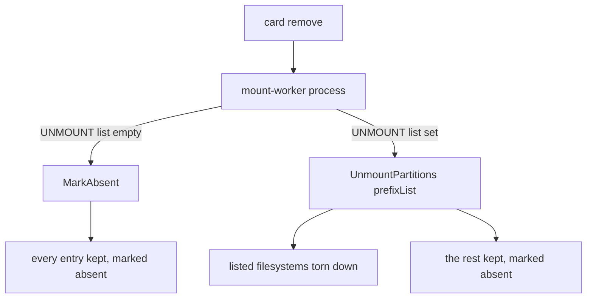
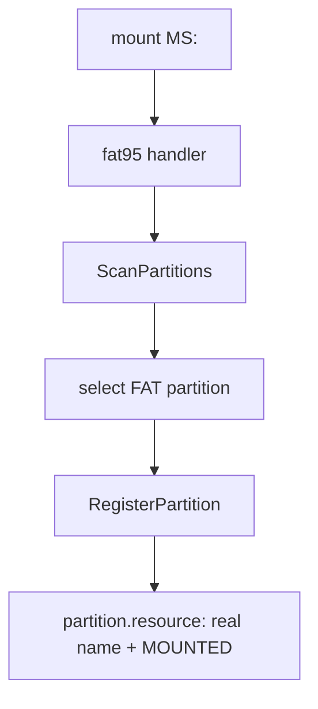

# ptable.library: unified partition-table library

`ptable.library` parses every partition scheme a removable card might carry (**RDB**, **MBR**, **GPT**, and the partition-table-less **flat** superfloppy, a whole-disk FAT volume) and publishes the result into `partition.resource`. Any driver or handler reads the layout from there instead of parsing the card itself, so one parse is shared rather than repeated.

You never run it yourself; other components open it. This document explains what it does, what you see when it works, and how its behaviour is configured. The `lsptres` tool (see [`lsptres.md`](lsptres.md)) shows what it has discovered at runtime. The library ships alongside its consumer `compactflash.device`, or embedded in a Kickstart ROM for cold-boot autoboot (see the [amigaos-kickstart-builder](https://github.com/pulchart/amigaos-kickstart-builder) repo).

## What it does

Two jobs, at two different times.

**Cold-boot autoboot.** At Kickstart cold start, before DOS exists, the `compactflash.autoboot` cold stub (a romtag inside `compactflash.automount`) calls `BootScanPartitions`. The library scans the card, publishes every partition it finds into `partition.resource`, loads any filesystem handlers stored in the RDB into `FileSystem.resource`, and then registers the **RDB** partitions: the bootable ones with `AddBootNode` so they appear in the Early Startup boot menu, the rest with `AddDosNode`. This is what lets you boot straight off an RDB-partitioned card in the PCMCIA slot.

MBR, GPT and flat partitions are published but not registered at cold boot: DOS does not exist yet, so their mount configuration cannot be read. The DOS-time automount mounts them a moment later.

Registering a partition needs a handler for its filesystem already in `FileSystem.resource`. FAT partitions match any registered `FAT\x` handler, every other filesystem must match its DosType exactly. With no handler the partition stays published but unmounted, listed by `lsptres` as `P----`.

**DOS-time scan and automount.** When a card is inserted after the machine is up, the consumer's mount worker (brought up by `compactflash.automount`) calls `ScanPartitions` to publish the card's partitions, then `MountPartitions` to mount them. On removal it calls `UnmountPartitions` or `MarkAbsent`, depending on the configured policy.

A rescan is a reconcile, not an append: every entry for that device and unit is first marked not-present, each partition found refreshes its existing slot in place (geometry, DosType, name) or gets a new one, and entries that are gone are freed. An entry that is gone but still mounted is marked invalid (`I`) instead, which is what you see after a card swap. `ScanPartitions` returns only the number of entries it published for the first time, so a rescan of an unchanged card returns 0.

In `compactflash.device` automount is on by default; `AUTOMOUNT 0` in `cfd.prefs` turns off the mount step only. The scan still runs and the partitions are still published, so `lsptres` lists them. Removal is never gated by `AUTOMOUNT`.

## Flows

The four use cases, shown as the LVO calls each one drives. They all end at `partition.resource`, the shared registry.

**Cold-boot autoboot.** The `compactflash.autoboot` cold stub calls `BootScanPartitions`; bootable RDB partitions become boot-menu entries, the other RDB partitions mountable volumes. MBR, GPT and flat partitions are published only.


```mermaid
graph TD
  A[compactflash.autoboot] --> B[BootScanPartitions]
  B --> C[scan card + load FS handlers]
  C -->|RDB bootable| D[AddBootNode]
  C -->|RDB mountable| E[AddDosNode]
  C -->|MBR/GPT/flat| G[published only]
  D --> F[partition.resource]
  E --> F
  G --> F
```

**Hotplug attach (DOS time).** A card insert wakes the consumer's mount worker, which publishes then mounts the card's partitions.


```mermaid
graph TD
  A[card insert] --> B[mount-agent task]
  B --> C[mount-worker process]
  C --> D[ScanPartitions]
  D --> E[MountPartitions]
  E --> F[partition.resource]
```

**Hotplug detach (card removed).** Two policies (see [Configuration](#configuration)): keep the handler or tear it down.


```mermaid
graph TD
  A[card remove] --> B[mount-worker process]
  B -->|UNMOUNT list empty| C[MarkAbsent]
  B -->|UNMOUNT list set| D[UnmountPartitions prefixList]
  C --> E[every entry kept, marked absent]
  D --> F[listed filesystems torn down]
  D --> G[the rest kept, marked absent]
```

**Handler mount, auto-detect (e.g. fat95).** A handler probes a card, lets `ScanPartitions` publish the candidates, picks its partition, and overlays its real DOS name with `RegisterPartition`.


```mermaid
graph TD
  A[mount MS:] --> B[fat95 handler]
  B --> C[ScanPartitions]
  C --> D[select FAT partition]
  D --> E[RegisterPartition]
  E --> F[partition.resource: real name + MOUNTED]
```

## Partition names

**RDB** partitions keep their on-disk name (`pb_DriveName`) verbatim, for example `DH0`.

**MBR, GPT and flat** partitions carry no on-disk name, so the library synthesizes one: `PREFIX` + unit-letter + partition-number.

- **PREFIX:** a short device abbreviation from a built-in table, or, for devices not in the table, the device's base name with `.device` stripped and the `A-Z` and `0-9` characters uppercased. Currently only `compactflash.device` has an abbreviation (`CF`); everything else falls back to the base name.
- **unit-letter:** lowercase `a` + unit (`a` = unit 0, `b` = unit 1, up to `p` = unit 15). Omitted on unit 0 of a device whose abbreviation-table entry is flagged single-unit; currently `compactflash.device`, so its names carry no letter.
- **partition-number:** 0-based decimal.

| Device | Unit | Synthesized names |
|--------|------|-------------------|
| `compactflash.device` (abbrev `CF`, single-unit) | 0 | `CF0`, `CF1`, `CF2` |
| `scsi.device` (base name to `SCSI`) | 0 | `SCSIa0`, `SCSIa1` |
| `scsi.device` | 2 | `SCSIc0`, `SCSIc1` |
| `mfm.device` (base name to `MFM`) | 1 | `MFMb0`, `MFMb1` |

To give a device its own abbreviation instead of the base-name fallback, or to drop the unit letter for a single-unit device, add it to `s_devAbbrevTable` in [`../src/ptable_scan.s`](../src/ptable_scan.s).

**Two names, `scanname>dosname`.** `lsptres` shows both names when the DOS device name differs from the scan name, and there are two ways that happens:

- You mount the partition yourself from a static `DEVS:DOSDrivers` entry. The handler registers its real DOS name, plus the Flags and CONTROL it opened the device with, back onto the published entry, so `CF0>MS0` is the partition scanned as `CF0` and mounted as `MS0:`. This is the same `RegisterPartition` path cfd's automount uses, so the `MFlg` and `Ctrl` columns are accurate whichever way a partition was mounted. A partition already mounted by another node is not taken over: fat95 does not claim it (the second mount reports `object in use`), so one partition is never served by two handlers. The `MOUNT_USED 1` policy in `cfd.prefs` (stamped into the entries like `UNMOUNT_STATIC`, so it takes effect on the next insert) overrides that deliberately, at the user's own risk - and the resource then lists the extra mount as its own row: the owner's row is never overlaid, the second registration gets a cloned entry, so `lsptres` shows e.g. `CF0>CFAUX` and `CF0>CFA0` side by side. The extra row is freed when its handler unregisters (clean shutdown) or when the teardown retires it.
- The name clashed with an existing mount and was uniquified at register time. Two cards whose RDBs both define `DH0` give `DH0` and `DH0>DH0.1`.

A handler that leaves voluntarily (its `ACTION_DIE` accepted, e.g. `MOUNT <dev>: SHUTDOWN`) unregisters its mount on the way out: the entry returns to published-only (`P----`) and the partition is the automount's again. A handler that disappears without that (killed, crashed) leaves the entry claimed until the next card removal under a tearing `UNMOUNT` policy cleans it.

## Configuration

`ptable.library` has no preferences file of its own. Its behaviour comes from two places.

**1. On-disk RDB metadata (cold-boot path).** Each RDB partition carries its own flags, and the library uses them as-is:

| RDB partition flag | Result |
|--------------------|--------|
| bootable (bit 0 set) | appears in the Early Startup boot list |
| bootable clear | mounted as a DOS volume, not offered as a boot device |
| NOMOUNT (bit 1 set) | published but never mounted |

BootPri, stored in the partition environment, does not decide bootability; it orders the boot list. To change which partition boots, or whether one mounts, edit the RDB with a partitioning tool such as HDToolBox.

**2. The consumer's mount configuration (`MountCfg`, DOS-time path).** `MountPartitions` takes an optional `MountCfg` supplying a global mount `Flags` value, a global `CONTROL` string, a per-filesystem override table, and the pair `mc_NodeDosType` / `mc_NodeHandler`. The library resolves each partition's `Flags` and `CONTROL` by its DosType (matching the high three bytes, e.g. `FAT\0`), falling back to the global value. Passing `0` selects cold-boot defaults.

`mc_NodeDosType` and `mc_NodeHandler` decide **which filesystem serves a partition** whose envec this library synthesized, i.e. one from an MBR, GPT or flat (whole-disk FAT) card rather than an RDB. They are described under [Choosing the filesystem](#choosing-the-filesystem) below.

For `compactflash.device` these values come from `ENV:cfd.prefs`: the `FLAGS` and `CONTROL` keys, global and `_<fs>` per filesystem. So to change how hotplugged cards mount, you edit `cfd.prefs`, not `ptable.library`. The resolved values are recorded per partition and shown live by `lsptres` in its `MFlg` and `Ctrl` columns.

The full user-facing reference for the `cfd.prefs` keys, plus deployment defaults and the removable-media model, is `compactflash.device`'s automount guide (`automount.guide`).

### Choosing the filesystem

`mc_NodeDosType` and `mc_NodeHandler` decide which filesystem serves a partition that came from an MBR or GPT table or a flat (whole-disk FAT) card. They apply to FAT-family entries only, and never to RDB: an RDB envec is the card's own, its `de_LowCyl`/`de_HighCyl` are real cylinders against real `de_Surfaces`/`de_BlocksPerTrack`, and writing block counts into those fields would be nonsense.

- **Neither set:** the envec stays exactly as the scan built it and the handler comes from `FileSystem.resource`. This is the default and is unchanged.
- **`mc_NodeDosType` set:** the node carries that DosType and gets the partition's own block range in `de_LowCyl`/`de_HighCyl`. The handler still comes from `FileSystem.resource`.
- **`mc_NodeHandler` set:** the envec is untouched, so auto-detect is preserved; the path is used only if `FileSystem.resource` has nothing for the node's DosType.
- **Both set:** that DosType, that window, and the path as the fallback for the lookup.

Naming a DosType also fixes the window, and that is not two settings collapsed into one: a handler told which filesystem to be is not a handler auto-detecting its own partition, so it needs to be given the partition. The arithmetic is exact because a synthesized envec uses `Surfaces = 1`, `BlocksPerTrk = 1`, one block per cylinder. Leaving `mc_NodeDosType` at `0` leaves the envec untouched, so the default path is unchanged.

`mc_NodeHandler` is consulted only when nothing in `FileSystem.resource` matches the node's DosType. The node is then built with that path in `dn_Handler` and `dn_SegList = 0`, so DOS loads the handler on first reference, exactly as a `DEVS:DOSDrivers` mount does. Resource first, path second, means that when a handler later becomes resident the path can simply be dropped from the configuration. A path that does not resolve leaves the node with no process; nothing is torn down and DOS retries on the next reference. The library copies the string, which it does not own past the call; a handler path is clamped to 23 characters and a CONTROL string to 31.

A fixed window does not follow a card swap the way the auto-detect scheme does, so it belongs with a teardown detach policy rather than with `MarkAbsent`. The failure mode is benign either way: a handler re-reads the boot block at the start of its window on every media change, so a different card either genuinely has a volume at that offset or reports not-a-DOS-disk.

**Detach policy (card removal).** Two ways to handle a removed card's partitions:

- **Keep, `MarkAbsent`:** clear `PRESENT` but keep the DOS node and handler in memory. The entry stays listed as absent-but-mounted (`---M-`), and reinserting the same card reattaches it without re-initialising the handler. This is the native AmigaOS removable-media model. `compactflash.device` takes this path when the `UNMOUNT` key lists no recognised filesystem, `UNMOUNT NONE` being the usual spelling.
- **Tear down, `UnmountPartitions` with a prefix list:** stop the handler, remove its DOS node (ACTION_DIE + RemDosEntry + free the node) and drop the entry from the resource. Only filesystems in the list are torn down; any other matched entry is kept and marked absent, exactly as `MarkAbsent` would leave it. With no prefix list every mounted entry for the device and unit is torn down. `compactflash.device` passes all supported filesystems by default, and an explicit `UNMOUNT` key restricts it, for example `UNMOUNT FAT`.

Static mounts can be exempted from tear-down. A static mount is an entry whose DOS node the library did not build itself: a hand-mounted `DEVS:DOSDrivers` entry that claimed its partition via `RegisterPartition`, or one the mount-time name reuse adopted. The exemption is per-entry resource state: `MountPartitions` stamps the caller's `mc_UnmFlags` keep policy into the entry's `PEB_KEEPSTATIC` bit on every pass, `UnmountPartitions` obeys the bit, and `lsptres` shows it in the fifth Flags position (`S` = static mount kept on removal, `s` = static mount following the normal policy), so the display and the behaviour can never disagree. A kept mount is only marked absent, never torn down; removing its node is the user's call, not a card event's, and a full build prints `static mount kept` on serial when the rule fires. With the bit clear (the default; the cold-boot path passes no config and never stamps) a static mount follows the normal policy. `compactflash.device` exposes the policy as `UNMOUNT_STATIC 0` in `cfd.prefs`; being stamped at mount time, a change takes effect on the next insert.

**When an unmount does not happen.** `UnmountPartitions` keeps the mount and only marks the partition absent if the handler declined `ACTION_DIE` with an error code, if it is still alive three seconds after the packet, or if the DOS device list stays busy for a second. Nothing is freed in that case: the DOS node and the handler are left as they were, and the next card removal tries again. Expect `UnmountPartitions` to return fewer entries than were mounted, and the resource to still hold `---M-` rows afterwards.

A volume that is still in use is the ordinary reason an unmount does not happen. A filesystem cannot give up a volume that something holds a lock on, because the volume node has to stay in the DOS list for that lock to remain valid. Release whatever holds it, for example by closing its Workbench window, and the next removal unmounts it.

## What it looks like (serial debug)

The `full` build prints its progress to the serial port at 9600 baud, the `small` build is silent. The library tags its own lines `[PT]`. In the traces below the surrounding `[CFD] boot:` and `[MW]` lines come from `compactflash.device` and show where the library was called from.

**Cold boot, RDB autoboot.** The cold stub opens the library and calls `BootScanPartitions`:

```
[CFD] boot: open ptable.library ...
[CFD] boot: ptable.library not preloaded, InitResident()...
[CFD] boot: BootScanPartitions(compactflash.device,0)
[PT] cold boot: scanning for partitions
[PT] RDB partition table
[PT] + filesystem handler PFS v20.0
[PT] new partitions: 5
[PT] - skip  SDH10 (no-mount)
[PT] - skip  SDH11 (no-mount)
[PT] + boot  SDH0 (PFS., 512 MB)
[PT] + mount SDH1 (PFS., 4096 MB)
[PT] + mount SDH2 (PFS., 21767 MB)
[PT] cold boot done, partitions registered: 3
```

Five partitions are published, the two NOMOUNT entries are skipped, one bootable is registered (`+ boot`) and two mountable (`+ mount`). The DosType prints as four characters with `.` standing in for a NUL byte, so `PFS\0` reads `PFS.`.

A FAT card at cold boot is published and left for DOS time, which is what the other skip reason means:

```
[PT] cold boot: scanning for partitions
[PT] GPT partition table
[PT] new partitions: 1
[PT] - skip  CF0 (not RDB: mounted at DOS time)
[PT] cold boot done, partitions registered: 0
```

**Hotplug, DOS-time scan.** An inserted card is scanned, published, then mounted by the consumer's mount worker. Here a GPT card with three FAT partitions:

```
[MW] scanning compactflash.device:0 for partitions
[PT] scanning for partitions
[PT] GPT partition table
[PT] new partitions: 3
[MW] scan done, new partitions: 3
[MW] mounting new partitions
[PT] mounting partitions
[PT] mounted CF0 (FAT., 2048 MB)
[PT] mounted CF1 (FAT., 4096 MB)
[PT] mounted CF2 (FAT., 8192 MB)
[MW] mounted volumes: 3
```

`[PT] reusing handler <name>` appears in place of `mounted` when a DOS node of that name already exists and is rebound instead of created, and `[PT] mounted as <name>` when a handler overlays its own DOS name through `RegisterPartition`. A whole-disk card prints `[PT] whole-disk FAT (superfloppy)` in place of a partition-table line.

The resulting `partition.resource`, listed by `lsptres` (columns explained in [`lsptres.md`](lsptres.md)):

```
Name         Device        Unit Part Src Pri DosType    Text Flags  MFlg Ctrl
------------ ------------- ---- ---- --- --- ---------- ---- ----- ----- ----------
CF0          compactflash.    0    0 GPT   0 0x464154FF FAT. P--M-     0 -d-D
CF1          compactflash.    0    1 GPT   0 0x464154FF FAT. P--M-     0 -d-D
CF2          compactflash.    0    2 GPT   0 0x464154FF FAT. P--M-     0 -d-D
```

All three are mounted (`P--M-`), with the `Ctrl` value `-d-D` resolved from `CONTROL_FAT` in `cfd.prefs`.

**Card removed, keep policy.** With `UNMOUNT NONE` the handlers stay in memory and the entries are only marked absent, so reinserting the same card reattaches them:

```
[MW] card removed
[PT] card removed, media absent
[MW] entries detached: 3
```

The count is `MarkAbsent`'s return: entries whose present flag was cleared, not mounts torn down (none are).

```
CF0          compactflash.    0    0 GPT   0 0x464154FF FAT. ---M-     0 -d-D
CF1          compactflash.    0    1 GPT   0 0x464154FF FAT. ---M-     0 -d-D
CF2          compactflash.    0    2 GPT   0 0x464154FF FAT. ---M-     0 -d-D
```

**Card removed, teardown policy.** With the default list, or `UNMOUNT FAT` here, the FAT partitions are unmounted and dropped from the resource:

```
[MW] card removed
[PT] unmounting partitions
[PT] unmounted CF0
[PT] unmounted CF1
[PT] unmounted CF2
[MW] entries detached: 3
```

A handler that will not go says why: `[PT] ACTION_DIE declined, code <n>` when it refused outright, or `[PT] ACTION_DIE unanswered, handler alive` when it never replied, followed by `[PT] partition kept, marked absent`. That partition stays `---M-`.

## Public interface for developers

`OpenLibrary("ptable.library", 2)`. The tree builds one version, 2.0, and every shipping consumer opens it at version 2 on every path, cold stub included.

```
BootScanPartitions(deviceName:a1, unit:d0)                 -30
ScanPartitions(deviceName:a1, unit:d0)                     -36
MountPartitions(deviceName:a1, unit:d0, cfg:a0)            -42
UnmountPartitions(deviceName:a1, unit:d0, prefixList:a0)   -48
RegisterPartition(deviceName:a1, unit:d0, startLBA:d1, blockCount:d2,
                  nameBSTR:a0, devNode:a2, flags:d3, control:d4,
                  nodeDosType:d5)                                 -54
MarkAbsent(deviceName:a1, unit:d0)                         -60
UnregisterPartition(deviceName:a1, unit:d0, startLBA:d1, devNode:a2)  -66
```

| LVO | Returns in d0 | Call from |
|-----|---------------|-----------|
| `BootScanPartitions` | partitions registered | `RTF_COLDSTART`, pre-DOS, single task |
| `ScanPartitions` | partitions **newly** published | any task, Exec context |
| `MountPartitions` | partitions mounted | a process |
| `UnmountPartitions` | entries torn down | a process |
| `RegisterPartition` | 1 updated, 0 not found | any task, Exec context |
| `MarkAbsent` | entries cleared | any task, Exec context |
| `UnregisterPartition` | 1 cleared, 0 no-op | any task, Exec context |

Notes a consumer needs:

- `MarkAbsent` never blocks: it takes the resource lock with an attempt and does nothing at all if the lock is busy, so a return of 0 does not mean there were no entries.
- `RegisterPartition` matches on device, unit and start block. `control` is a BSTR pointer, `0` for none. `nodeDosType` (d5) records the DosType the handler mounted with into `pe_NodeDosType`, `0` meaning unknown. Register inputs cannot be gated by a declared size the way `mc_` fields are, so a future input means a new LVO.
- `UnregisterPartition` is the inverse, for a handler whose `ACTION_DIE` was accepted outside a ptable teardown: the entry returns to published-only and the partition is the automount's again; an extra-mount row is unlinked and freed. Only the registrant may clear its own entry (`devNode` must match). Like `MarkAbsent` it only attempts the lock, and skips when a teardown holds it.
- `cfg` is a `MountCfg` (or `0` for cold-boot defaults): global `mc_Flags` and `mc_Control` plus a 0-terminated per-dostype override table, resolved by `(pe_DosType & $FFFFFF00)`, and `mc_NodeDosType` / `mc_NodeHandler`. The override row is deliberately not grown for new settings: the library strides that table with its own idea of the row size, so a caller built against a different header would desynchronise. New settings go in the `mc_` block, behind `mc_Size` - the caller's own `mc_Sizeof`, MountCfg's `de_TableSize`: a field appended in a later release is read only when the caller's declared size covers it.
- `prefixList` is a 0-terminated list of dostype high three bytes, e.g. `$50465300` for `PFS`.
- `BootScanPartitions` also registers a synthetic ConfigDev (Vendor ID `65535`, Product ID `1`) when it registered at least one node, which is what puts the device in the Early Startup boot menu and in `ShowConfig`.
- For MBR, GPT and flat partitions the mount path builds an auto-detect DeviceNode by default: `de_LowCyl = 0` and the device-scheme DosType `$464154FF`, so one persistent fat95 handler binds once and picks its partition from the trailing digit of the node name. That is how a single handler tracks any card layout across swaps.
- `mc_NodeDosType` / `mc_NodeHandler` override that; see [Choosing the filesystem](#choosing-the-filesystem).
- The DosType a node actually carries is recorded in `pe_NodeDosType`, and is what `lsptres` prints in its `DosType` column for a mounted partition. `pe_DosType` stays the **detected** filesystem, so `Flags`/`CONTROL`/unmount prefix matching is unaffected.

**`partition.resource` layout.** Readers walk `ptr_PartList` under `Forbid()` or take `ptr_Lock`. `OpenResource` cannot negotiate versions, so the only runtime layout signal is the pair of stamps in the header, `ptr_Layout` (currently `PTR_LAYOUT_V = 5`) and `ptr_EntrySize`, plus `pe_Length` per entry. Fields are appended only, never inserted, because `lsptres` and fat95 ship separately-built offset mirrors; a consumer that needs a newer field checks the stamp and degrades if it is older. The full field layout is in [`../src/ptable_pub.i`](../src/ptable_pub.i).

**Lock order.** `ptr_Lock` is the outer lock, DOS list locks are only ever taken inside it, and a handler started by the library must not call back into a ptable LVO while starting up.

**Resident priorities**, for ROM integrators: `ptable.library` at 22 and `compactflash.device` at 21, both `RTF_AUTOINIT` and ahead of everything that uses them, and the cold stub `compactflash.autoboot` at -5. The stub has to run after every ROM filesystem has registered in `FileSystem.resource` (fat95 registers at 0) or it binds no handler, and well above `strap` at -60, because `AddBootNode` must happen before strap runs.

## See also

- [`lsptres.md`](lsptres.md): the `lsptres` CLI lists `partition.resource`, every partition this library has published, its mount state, and the resolved Flags and CONTROL.
- `cfd.prefs`: the `FLAGS`, `CONTROL`, `DOSTYPE_FAT` and `HANDLER_FAT` keys that `compactflash.device` turns into the `MountCfg` for `MountPartitions`. Its automount guide is the worked example for choosing a filesystem.
- [`compactflash.device`](https://github.com/pulchart/cfd): the primary consumer (cold-boot autoboot + hotplug automount).
- [`fat95`](https://github.com/pulchart/fat95): reads `partition.resource` for whole-disk partition auto-detection.
- [`../src/ptable_pub.i`](../src/ptable_pub.i): the public consumer header with full LVO, `MountCfg`, and `PartEntry` definitions.
